# Seam Carving for Content-Aware Image Resizing

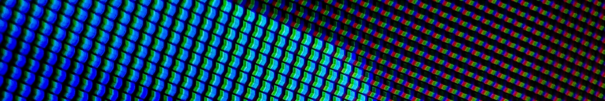

## Description

Seam Carving is a content-aware image resizing technique that preserves important image features by removing or inserting low-energy pixel seams. This implementation supports image reduction and expansion with less distortion than traditional scaling approaches.

This project demonstrates several fundamental concepts in image processing and algorithm design. It includes convolution using kernels, gradient or magnitude computation for vector fields, and dynamic programming for seam selection. Through the implementation of seam carving, readers can gain practical experience with image filtering, vector-based analysis, path optimization, and content-aware image manipulation.

## Requirement

- .NET SDK
- SixLabors.ImageSharp 3.1.11

## Setup

1. Clone the repository
2. Restore NuGet packages: `dotnet restore`
3. Build the project: `dotnet build`
4. Run the application: `dotnet run`

Important Note: This project is currently configured to use SixLabors.ImageSharp 3.1.11. Newer versions of ImageSharp may require additional licensing configuration and could cause build errors. If restoring packages manually, ensure that version 3.1.11 is installed.

## Process

The below example describes the process of seam carving to shrink 30% of the original width while preserving height (`.ShrinkTo("100%", "70%")`).

| Step                                                                                          | Image                                                                      |
| --------------------------------------------------------------------------------------------- | -------------------------------------------------------------------------- |
| 0. Start with Broadway tower image.                                                           | 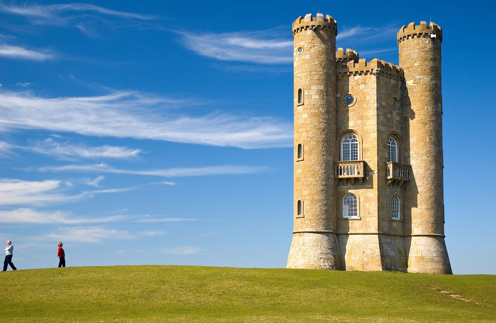                   |
| 1. Convert from colored image to grayscale image.                                             | 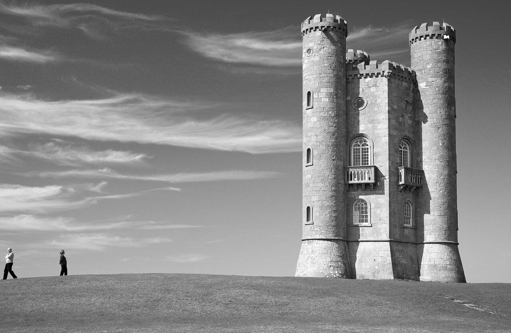   |
| 2. Calculate the energy of each pixel or create an edge map  using edge detection kernels. | 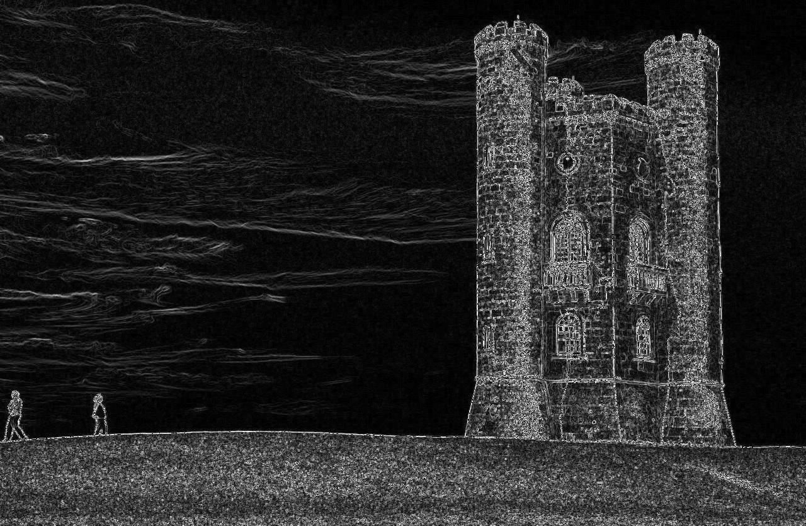     |
| 3. Find the lowest energy seam.                                                               |                                                                            |
| 4. Remove seam and recalculate edge/energy map.                                               |                                                                            |
| 5. Repeat steps 3 and 4 until reaching desired width.                                         |                                                                            |
| All lowest energy seams are marked as red.                                                    | 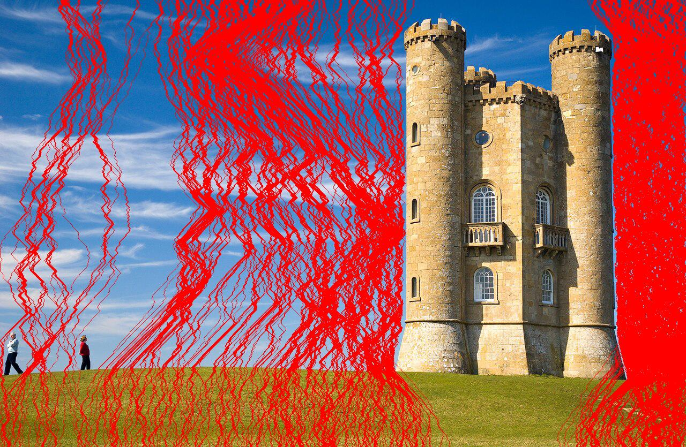 |
| Final image.                                                                                  | 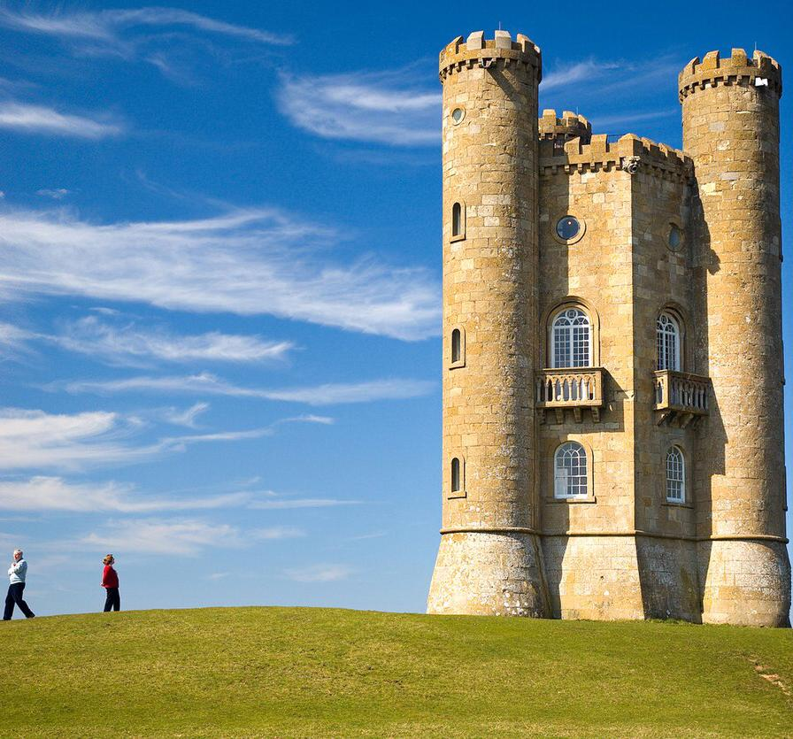      |

  
The below example describes the process of seam carving of 150%-width expansion (`ExpandWidthTo("150%")`) and 200%-width expansion(`.ExpandWidthTo("200%")`)

| Step                                                                                                                   | Image                                                                                    |
| ---------------------------------------------------------------------------------------------------------------------- | ---------------------------------------------------------------------------------------- |
| 0. Start with Broadway tower image.                                                                                    |                                  |
| 1. Perform seam carving technique  above to mark all the seam, same  as shrinking 50% width.                     | 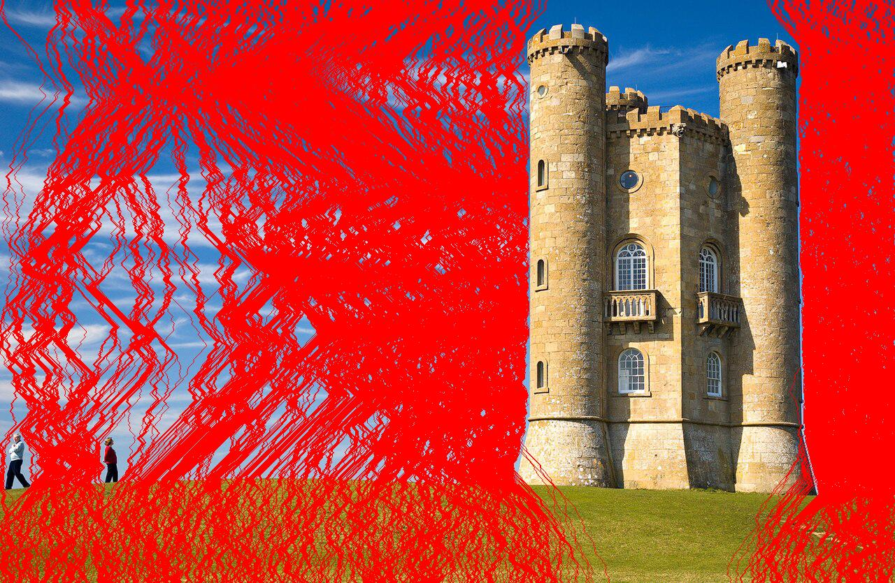     |
| 2. Add low-energy seams by  duplicating marked pixels.                                                              | 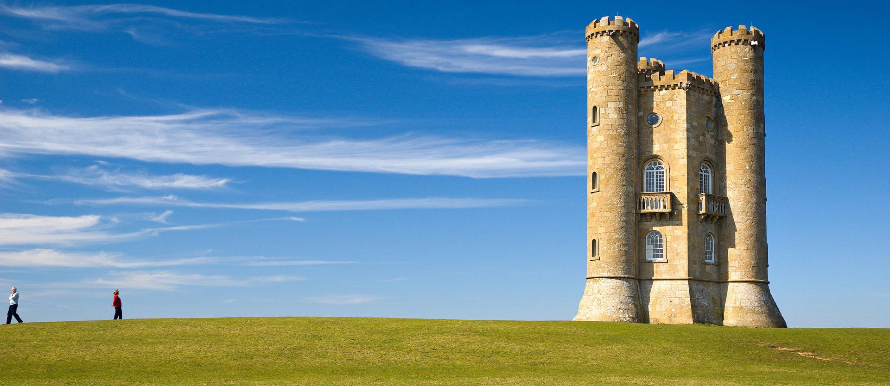                  |
| Expand to 200% width in one go will  add both low and high-energy seams,  stretching the objects and background. |                                                                                          |
| 3. Instead, perform a second expansion  on the 150%-width image to find lowest seams.                               | 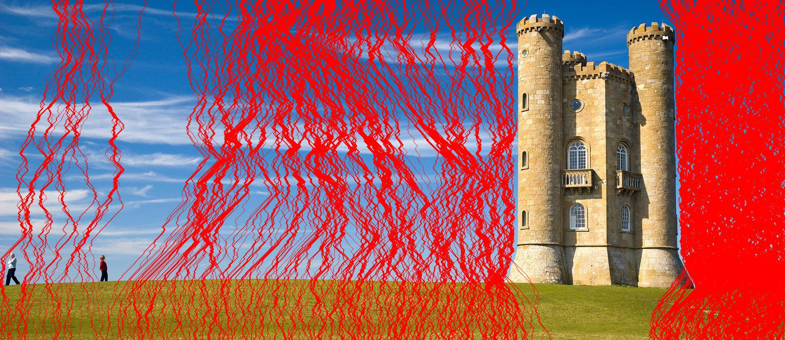 |
| Final image.                                                                                                           | 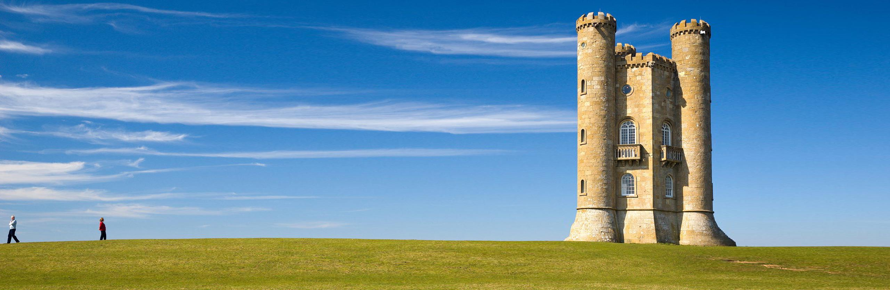    |

## Other examples

#### The Persistence Of Memory (Salvador Dalí)

<table align="center" style="border: none; border-collapse: collapse;">
  <tr style="border: none;">
    <td align="center" style="border: none; padding: 10px;">
      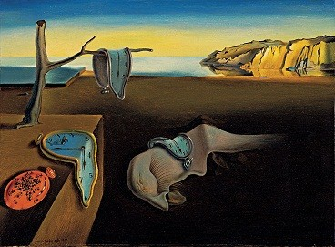 
      
Original image

    </td>
    <td align="center" style="border: none; padding: 10px;">
      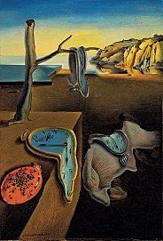 
      
50% width

    </td>
  </tr>
</table>

    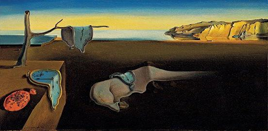   
    150% width

    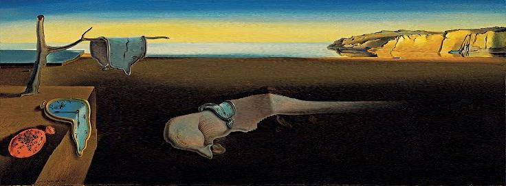   
    200% width

 
 

#### Broadway Tower

<table align="center" style="border: none; border-collapse: collapse;">
  <tr style="border: none;">
    <td align="center" style="border: none; padding: 10px;">
         
      
Original image

    </td>
    <td align="center" style="border: none; padding: 10px;">
      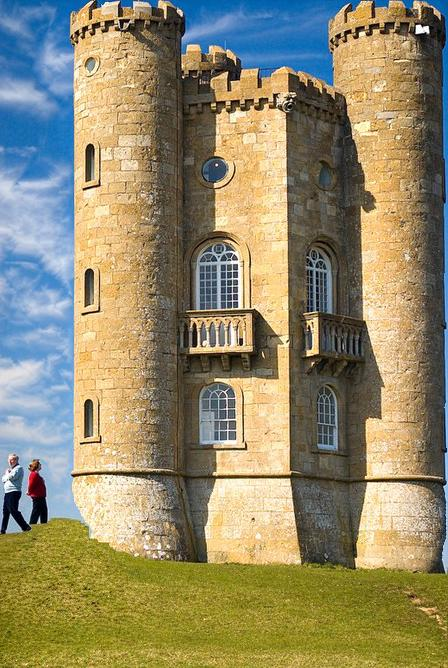 
      
80% height + 35% width

    </td>
  </tr>
</table>

 
 

#### School Of Fish (Jeremy Bishop)

      
    Original image

<table align="center" style="border: none; border-collapse: collapse;">
  <tr style="border: none;">
    <td align="center" style="border: none; padding: 10px;">
      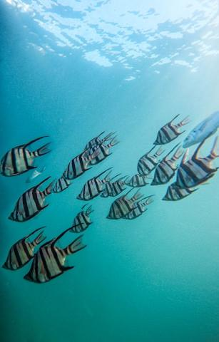   
      
48% width

    </td>
    <td align="center" style="border: none; padding: 10px;">
      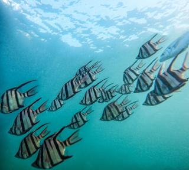 
      
60% height + 50% width

    </td>
  </tr>
</table>

    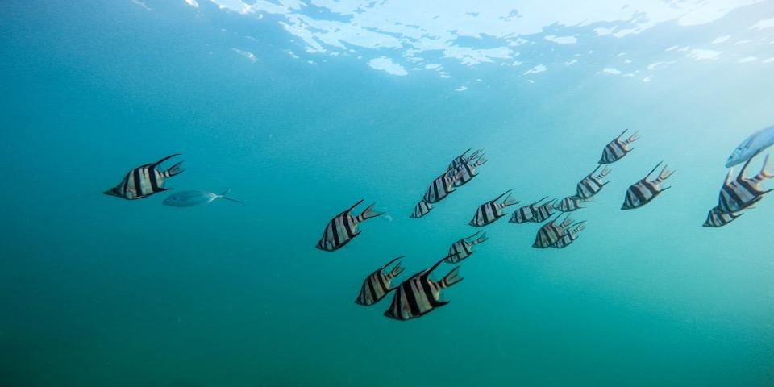   
    150% width

 
 

#### Silhouette Of Trees (Dave Hoefler)

<table align="center" style="border: none; border-collapse: collapse;">
  <tr style="border: none;">
    <td align="center" style="border: none; padding: 10px;">
         
      
Original image

    </td>
    <td align="center" style="border: none; padding: 10px;">
       
      
70% width

    </td>
  </tr>
</table>

       
    200% width

#### Snow Fox On Snow Field (Jonatan Pie)

<table align="center" style="border: none; border-collapse: collapse;">
  <tr style="border: none;">
    <td align="center" style="border: none; padding: 10px;">
        
      
Original image

    </td>
    <td align="center" style="border: none; padding: 10px;">
       
      
40% width

    </td>
  </tr>
</table>

       
    200% width

#### Lake And Trees (Alice Triquet)

<table align="center" style="border: none; border-collapse: collapse;">
  <tr style="border: none;">
    <td align="center" style="border: none; padding: 10px;">
        
      
Original image

    </td>
    <td align="center" style="border: none; padding: 10px;">
       
      
40% width

    </td>
  </tr>
</table>

       
    150% width

#### Herd Of Cows (Yang)

<table align="center" style="border: none; border-collapse: collapse;">
  <tr style="border: none;">
    <td align="center" style="border: none; padding: 10px;">
      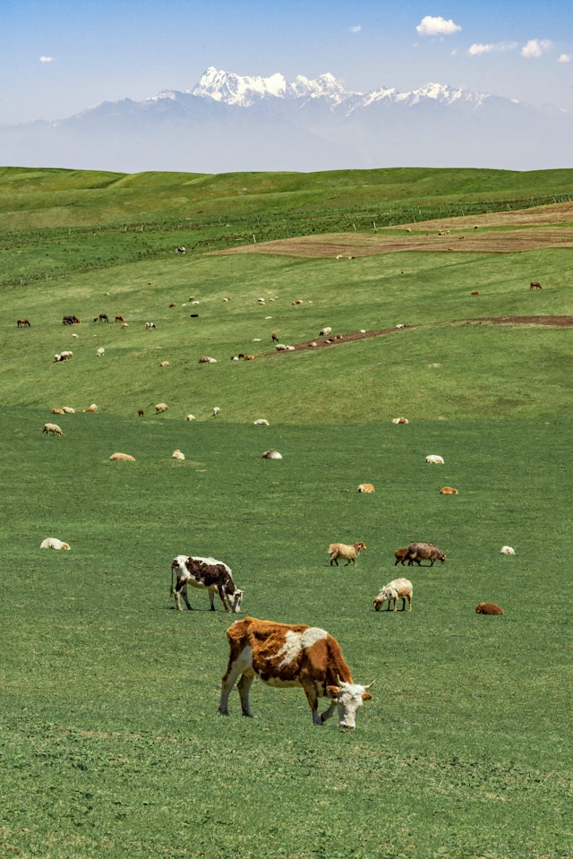  
      
Original image

    </td>
    <td align="center" style="border: none; padding: 10px;">
      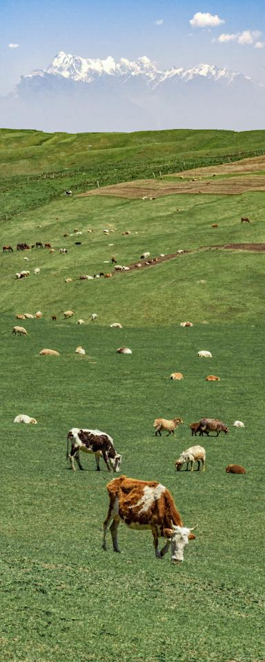 
      
40% width

    </td>
  </tr>
</table>

    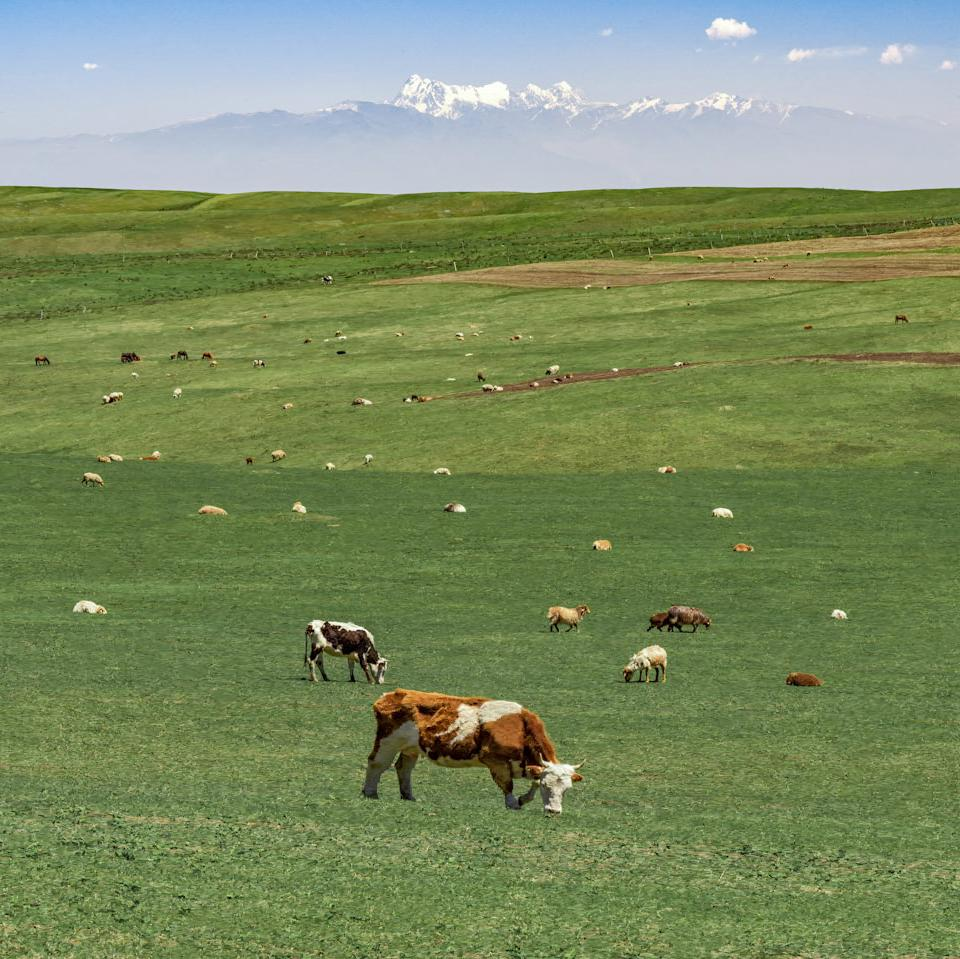   
    150% width

## Contributors

Kiet Tran

## DIY

Want to create your own application? Check out these useful resources:

[But what is a convolution?](https://www.youtube.com/watch?v=KuXjwB4LzSA "youtube") - 3Blue1Brown - The beautiful of math through convolution.

Edge handling - [Extend](<https://en.wikipedia.org/wiki/Kernel_(image_processing)#:~:text=handling%20image%20edges.-,Extend,extended%20in%2090%C2%B0%20wedges.%20Other%20edge%20pixels%20are%20extended%20in%20lines.,-Wrap> "wikipedia") - During convolution process, you need to pick your strategy for handling image edges.

[Seam Carving | Week 2, lecture 7 | 18.S191 MIT Fall 2020](https://www.youtube.com/watch?v=rpB6zQNsbQU "youtube") - A detail explanation with visual examples on seam carving

# References

Avidan, Shai; Shamir, Ariel (July 2007). "Seam carving for content-aware image resizing". ACM SIGGRAPH 2007 papers. p. 10. doi:[10.1145/1275808.1276390](https://dl.acm.org/doi/10.1145/1275808.1276390 "ACM Digital Library"). ISBN 978-1-4503-7836-9.
